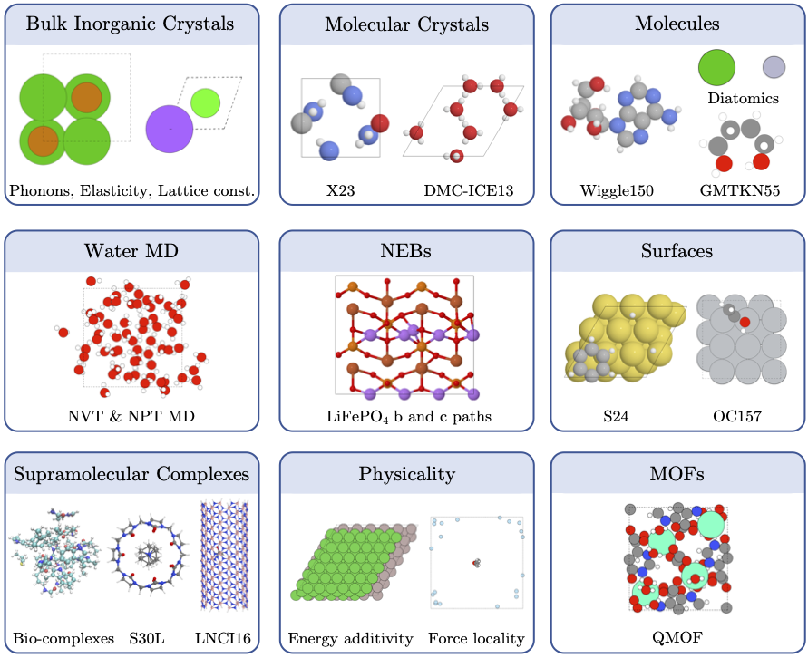

# A Comprehensive Testing Suite for Foundation MLIPs

This repository provides a comprehensive testing framework and interactive analysis suite for foundation Machine Learning Interatomic Potentials (MLIPs). The interactive analysis suite is currently hosted at:
[http://mlip-testing.stfc.ac.uk:8050](http://mlip-testing.stfc.ac.uk:8050)

Key goals of this framework include:
- Testing physics: Moving away from benchmarking solely on energies and forces
    - MD tests, NEBs, phonons, elastic moduli, and more
- Breadth: Testing on a wide range of systems to truely assess the ability of foundation MLIPs
    - Bulk inorganic crystals, molecular crystals, molecules, surfaces, MOFs, supramolecular systems, and more
- Depth: the ability to swiftly investigate numbers, outliers and trends through an interactive analysis suite featuring:
    - Interactive tables
    - Interactive plots
    - Structural visualisation
    - Custom benchmark weights

### Getting Started

### Summary of currently implemented tests:

  

